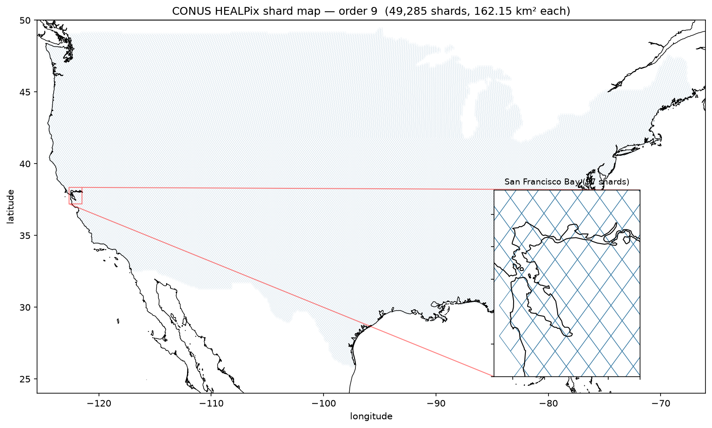
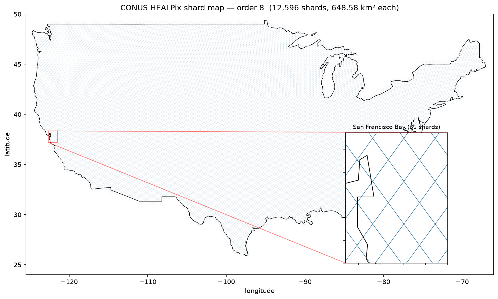

# CONUS cost estimate (issue #202, leg 4)

> **Recommendation: order 9 at 4 GB is the default operating point; order 8 is now
> tractable too (via spill).** As of **0.36.0**, both orders run CONUS cleanly on
> `process-shard-4096-disk` (4 GB RAM + ephemeral spill disk), **hive + sidecar +
> spill** — all 25 o9 *and* all 25 o8 stratified shards finish under the 900 s
> worker at 4 GB. **`streaming_mode: spill` is what unlocked o8**: it spills photons
> to on-disk partitions so the whole-shard t-digest state no longer has to sit in
> RAM (the architectural fix §4c anticipated as #217). o8 would **OOM without it**.
> The residual caveat is memory *headroom*, not failure: the densest o8 shards peak
> at **~3.7 GB of 4 GB RAM** (§4c), so an **8 GB-RAM o8 arm** is worth adding for
> margin. o9 keeps a comfortable ~1.5 GB peak and is the safe default; o8 costs less
> in total (fewer, larger shards) and is the coarsening win once the 8 GB arm lands.

**This is an estimate, not a benchmark result.** We are *not* running CONUS. This
document sizes what a full contiguous-US (lower-48) ATL03 aggregation *would*
cost, from (a) the real CONUS order-9 and order-8 shard maps we build offline and
(b) per-shard cost regressions fit from **measured 0.36.0 Lambda data** (25
stratified CONUS shards per order, §4b). All numbers are at zagg 0.36.0 —
**hive + sidecar + spill** on the `process-shard-4096-disk` worker, with the
**sharded** t-digest write (issues #209 / #211, so the pre-#211 write bloat is
gone) and the **#287/#288 store-cache fix**. Each order was run in two passes:
**v035** (cold sidecar cache, pre-#288) and **v036** (warm cache + the #288 fix —
the current-code numbers and the headline below).

> **Headline: o9 at 4 GB is the default operating point, o8 is newly tractable via
> spill.** Both orders complete all 25 stratified shards under 900 s at 4 GB. Peak
> RSS is driven by **cell-coverage density, not granule count** (§4c): o9 peaks
> ~1.5 GB, o8 peaks ~3.7 GB on its densest-coverage shards — `spill` keeps that
> under 4 GB where 0.24.0 pooling OOM'd. The **#288 store-cache fix** trims ~4–5 %
> off both orders at CONUS's ~80–210-granule scale (small here; decisive at the 88S
> pole — different regime, ref #148). The remaining upper-bound lever on the totals
> is the #65 swath over-assignment (§4d).

| 0.36.0 @ 4 GB, warm + #288 (v036) | cost (95 % CI) | wall @ 2,000 workers | peak RSS |
| --- | ---: | ---: | ---: |
| **Order 9** (49,285 shards) | **$379** ($339–419, ±11 %) | **~1.0 h** | ~1.5 GB |
| **Order 8** (12,596 shards) | **$211** ($180–243, ±15 %) | **~0.6 h** | ~3.7 GB |

Before the #288 store-cache fix (v035, cold cache): o9 **$394** ($351–437), o8
**$223** ($192–255) — the fix is worth ~4 % (o9) / ~5 % (o8) on the full-CONUS
total (§4b). For reference, the prior 0.24.0 o9 estimate quoted first-run (cold
`inline`) **$471** and repeat (warm `sidecar`) **$419**; the 0.36.0 warm+fix o9
operating point is **$379**.

Everything here is reproducible offline from the committed artifacts (the dollar
totals additionally require the measured regression JSONs under
`data/conus/results/`, from a real billed 25-shard dispatch):

| Artifact | What |
| --- | --- |
| `data/conus/conus.geojson` | the polygon reference the shard map is built over |
| `data/conus/build_conus_polygon.py` | builds `conus.geojson` (provenance below) |
| `data/conus/build_conus_shardmap.py` | builds the o9 (or `--order N`) shard map + artifacts |
| `data/conus/conus_shard_granule_counts.parquet` | per-shard granule-count table (the load-bearing artifact) |
| `data/conus/conus_shard_stats.json` | summary stats + granule distribution |
| `data/conus/select_regression_shards.py` | stratified <=25-shard regression-training plan |
| `data/conus/run_conus_regression.py` | billed dispatch driver (hive + sidecar + spill) |
| `data/conus/results/conus_o{8,9}_v0{35,36}.json` | measured 25-shard 0.36.0 per-shard records (v035 cold cache / v036 warm + #288) |
| `data/conus/conus_final_estimate.py` | applies each order's v035/v036 fit to the CONUS distribution with a 95 % interval |

## 1. Polygon reference

- **Region:** CONUS — the 48 contiguous states plus DC (Alaska, Hawaii, Puerto
  Rico excluded).
- **Source:** `us-states.json` from PublicaMundi/MappingAPI (a widely-used,
  Census-derived, simplified US state outline; MIT-licensed).
- **Construction:** `unary_union` of the 48 contiguous states + DC, `buffer(0)`
  to heal inter-state seams. No further simplification (the source is already
  ~800 vertices). See `data/conus/build_conus_polygon.py`.
- **Bounding box (lon/lat):** `[-124.707, 25.121, -66.980, 49.384]`.
- **Parts:** 5 (mainland + coastal-island groups).
- **Area:** **7,805,341 km²** (EPSG:5070 CONUS Albers equal-area).

The bbox edges do not lie on a HEALPix base-cell boundary (lon ≡ 0 mod 45° or
lat 0), and the outline is irregular, so the mortie base-cell polygon-fill bug
(espg/mortie#103, fixed in mortie 0.9.0) is not a concern; the build still runs
a cheap post-build **leak check** asserting every covered shard's cell centre
lies inside the CONUS bbox.

## 2. Summary statistics (order-9 shard map)

- **Grid:** HEALPix nested, `parent_order=9` (shard/dispatch unit), `child_order=19`
  (~10 m leaf cell), mortie MOC intersection.
- **Temporal:** `2018-10-13 → 2026-03-15` (mission launch → last granule in CMR;
  the entire ATL03 v007 collection, 555,867 granules).
- **Catalog prefilter:** the CONUS bbox + temporal cut leaves **28,429** of
  555,867 granules for the exact polygon intersection (bbox column is
  latitude-exact / longitude-conservative, so the cut drops nothing real).

<!-- CONUS_SUMMARY_TABLE -->
| Quantity | Value |
| --- | ---: |
| CONUS area (EPSG:5070) | 7,805,341 km² |
| Total o9 shards | **49,285** |
| One o9 shard area | 162.15 km² |
| Shard coverage area (49,285 × 162.15) | 7,991,345 km² (1.024× polygon — edge-shard overhang) |
| Distinct granules intersecting CONUS | **14,068** |
| Total (shard, granule) pairs (o9 reads) | **3,560,313** |
| Catalog granules (full ATL03 v007) | 555,867 |
| Survived bbox+temporal prefilter | 28,429 |
| Shard-map build wall | 291 s (mortie MOC order 13) |
| Leak check (mortie #103 guard) | **passed** — all cells in-bbox |

The shard coverage (7.99 M km²) exceeds the polygon area (7.81 M km²) by 2.4 %
because o9 shards on the boundary are kept whole (the AOI-overhang effect, issue
#101) — a real cost the estimate carries, since those edge shards dispatch in full.

The shard tiling (dispatch units) over CONUS, at both benchmark orders — the San
Francisco Bay inset makes the HEALPix diamond tiling legible (an o8 shard is 4× an
o9 shard's area, so ~4× fewer, larger diamonds in the same window: 31 vs 97). The
whole-CONUS panel is a fine mesh at this scale; the red box marks the inset window.
The land basemap is Natural Earth 1:10m land (public domain, clipped to CONUS →
`data/conus/conus_basemap_ne10m.geojson`) — **visualization only**; it resolves the
coastline (e.g. the SF peninsula) that the coarse `conus.geojson` shard-map AOI
smooths out. Rendered from the committed shard maps by
`data/conus/plot_conus_shardmap.py`.





## 3. Per-shard granule-count distribution

The regression's input variable is granules-per-shard. The full distributions are
in `data/conus/conus_shard_stats.json` (o9) and `conus_shard_stats_o8.json` (o8);
the per-shard tables are `conus_shard_granule_counts.parquet` /
`conus_shard_granule_counts_o8.parquet`.

<!-- CONUS_DISTRIBUTION_TABLE -->
| Statistic | o9 granules/shard | o8 granules/shard |
| --- | ---: | ---: |
| min | 21 | 43 |
| median | 70 | 111 |
| mean | 72.24 | 112.07 |
| p90 | 84 | 122 |
| p99 | 99 | 141 |
| max | 144 | 211 |
| total shards | 49,285 | 12,596 |
| total (shard, granule) pairs | 3,560,313 | 1,411,589 |

**Both distributions are sharply peaked** (the mid-latitude regime — no polar RGT
convergence): ~99 % of o9 shards carry 50–100 granules (median 70), a thin tail to
144; o8 (4× the area) roughly doubles that to a median 111, tail to 211. The
stratified regression sample spans the realised band at each order (o9 21–144, o8
43–211). Consequences for the regression:

- Every measured shard at both orders runs well under the 900 s timeout (o9 max
  347 s, o8 max 672 s), so **no shard is excluded** from the training selection —
  o8 running to completion at 4 GB is new in 0.36.0 and depends on `spill` (§4c).
- The fit is an **interpolation** across the realised granule band, not an
  extrapolation. But granule count is a *noisy* predictor (§4b): o9 fits cleanly
  (R² ~0.79) for a **±11 %** interval; o8's total is intercept-dominated (spill's
  fixed per-shard overhead) with a noisier slope (R² ~0.32) → a **±15 %** interval.

## 4. Operational-cost model

Cost is accounted in **four columns** with **Lambda GB-second the primary**,
applied across every CONUS shard at each order. The 0.36.0 runs fix the config
(**hive + sidecar + spill**, `process-shard-4096-disk`) and vary only the cache
state across two passes (per espg):

- **v035 (cold cache, pre-#288)** — first-pass read cost with a cold sidecar
  cache and the pre-#288 store-cache behaviour.
- **v036 (warm cache + #288 fix)** — the current-code operating point: warm
  granule-keyed chunk manifests plus the #287/#288 store-cache fix. **This is the
  headline.**

Each order fits its **own** measured regression per pass (§4b), applied to that
order's CONUS per-shard granule counts and summed. Primary GB-s totals (v036):

| Cost column | What it counts | Order 9 (v036) | Order 8 (v036) |
| --- | --- | ---: | ---: |
| **Lambda GB-s** (primary) | `Σ λ-seconds × 4 GB × $0.0000133334/GB-s`, via the per-order regression (§4b) | 28.4 M GB-s ≈ **$379** | 15.9 M GB-s ≈ **$211** |
| **S3 PUT/GET** | output PUTs (hive: K objects/shard; still no write storm post-#211) + one-time sidecar-manifest write on the first pass; GETs are granule byte-range reads (NSIDC bucket) | small one-time | small one-time |
| **CMR / catalog build** | one-time STAC/geoparquet catalog build (offline/local for CONUS) | ~$0 | ~$0 |
| **CloudWatch / logs** | ~one log stream per shard | ~$1–3 | ~$1 |

**o8 costs less in total than o9** despite peaking hotter on RAM: 12,596 shards
vs 49,285 amortises the per-shard overhead over ~4× fewer, larger dispatch units,
so the ~$211 o8 total undercuts o9's ~$379 — the coarsening win (§4c). o8 carries
a wider interval (±15 % vs ±11 %) because spill's fixed per-shard overhead
dominates its fit (§4b).

**The #288 store-cache fix is small at CONUS scale (~4–5 %).** The sidecar caches
the *index* (each granule's chunk map / HDF5 byte-ranges), not the photon data, so
it only trims the per-shard index-build phase — worth ~0.3 s/granule at CONUS's
~80–210-granule scale. At that density the photon read dominates, and concurrent
25-shard S3/Lambda contention swamps the per-shard saving (see the per-shard noise
in §4b). It is **decisive at the 88S pole instead** — a different, index-bound
regime (ref #148). The pre-#211 cold **S3 PUT storm** is long gone; the write phase
never dominates at either order.

### 4a. Wall-clock at scale

Idealised perfect-packing wall = `Σ λ-seconds / N_workers`, floored by the slowest
single shard (o9 ~347 s, o8 ~672 s — throughput-bound, not concurrency-bound). At
the v036 operating point:

| order (v036) | Σ λ-seconds | **wall @ 2,000 workers** | wall @ 1,000 workers |
| --- | ---: | ---: | ---: |
| Order 9 | 7.10 M | **~1.0 h** (59 min) | ~2.0 h |
| Order 8 | 3.96 M | **~0.6 h** (33 min) | ~1.1 h |

o8's coarser tiling means fewer total λ-seconds (fewer, larger shards), so its
wall is shorter despite ~2× the per-shard runtime. **2,000 concurrent is above the
current 1,000-per-account Lambda limit** — it assumes a limit increase; at the
default 1,000 the walls are ~2.0 h (o9) / ~1.1 h (o8).

### 4b. Regression — measured (25-shard CONUS dispatch, zagg 0.36.0, hive + sidecar + spill)

Fit from a **real 25-shard stratified CONUS run per order** on the
`process-shard-4096-disk` Lambda (4 GB RAM + spill disk, arm64), spanning the full
realised granule/shard band (o9 21–144, o8 43–211), in two passes each (v035 cold
cache, v036 warm + #288). **All 25 shards succeeded at both orders in both
passes** — o8 only because `spill` bounds RAM (§4c). Raw per-shard points:
`data/conus/results/conus_o{8,9}_v0{35,36}.json`.

| order · pass | fit (granules → λ-seconds) | R² | CONUS total | 95 % CI |
| --- | --- | ---: | ---: | ---: |
| **o9 · v036** (warm + #288) | `1.86 × granules + 10 s/shard` | 0.79 | **$379** | $339–419 |
| o9 · v035 (cold cache) | `2.03 × granules + 3 s/shard` | 0.79 | $394 | $351–437 |
| **o8 · v036** (warm + #288) | `1.52 × granules + 144 s/shard` | 0.32 | **$211** | $180–243 |
| o8 · v035 (cold cache) | `1.36 × granules + 181 s/shard` | 0.27 | $223 | $192–255 |

The **v035→v036 (store-cache-fix) effect** on the full-CONUS total is **−4 %** (o9,
$394→$379) / **−5 %** (o8, $223→$211); on the raw 25-shard sample it is −4.5 % (o9)
/ −4.3 % (o8). The per-shard delta is **noisy** — individual shards move −28…+26 %
(o9) and **−37…+32 %** (o8) — because concurrent-shard S3/Lambda contention swamps
the ~0.3 s/granule the fix saves at CONUS density. o8's low R² (0.27–0.32) reflects
that its runtime is dominated by spill's fixed ~150 s/shard flush/merge overhead,
not the granule slope — so its total is intercept-driven and carries the wider
±15 % interval; o9 (spill overhead near-zero at ~1.5 GB peak) stays slope-driven
with a clean ±11 %. Reproduce with `python data/conus/conus_final_estimate.py`.

**Confidence interval.** Granule count is a noisy cost predictor (R² 0.27–0.79
across orders), so the CONUS total is not a point value. The 95 % interval
propagates two sources in quadrature on `Σ λ-seconds = slope·G_total + intercept·N`:

1. **parameter uncertainty** (OLS covariance of slope/intercept) — *systematic*,
   correlated across all N shards; this is the **dominant** term and does not
   average out.
2. **per-shard residual scatter** — independent, so its contribution to the total
   grows only as √N and is near-negligible at CONUS N (a prediction-interval
   component, included for honesty).

See `estimate_with_ci.py` (per-file CLI) / `conus_final_estimate.py` (the
consolidated both-orders reproducer).

### 4c. Order feasibility — o8 is now tractable via spill; the wall is headroom, not failure

**Update (0.36.0): `streaming_mode: spill` unlocked o8.** The 0.24.0-era analysis
below (kept for the density insight and the fix rationale) concluded o8 hit a
whole-shard **t-digest memory wall** at 4 GB and that only an architectural change
— spill photons to on-disk partitions so the digest state need not sit in RAM,
tracked as #217 — would fix it. **That fix landed.** The 0.36.0 CONUS run
(`process-shard-4096-disk`, hive + sidecar + `spill`) completes **all 25 o8 shards
under 900 s at 4 GB**, including the exact dense shards that OOM'd at 0.24.0 (the
85 g / 148 g / 155 g shards now run at 3.65 / 3.71 / 2.96 GB). So o8 is no longer
gated on RAM — the residual is **headroom, not feasibility**: the densest o8 shard
peaks at **~3.7 GB of 4 GB**, thin margin. **Recommend adding an 8 GB-RAM o8 arm**
so the dense-coverage tail has room (it does not change the GB-s *fit*, which is
timing-driven; it buys reliability against a shard that lands hotter than the
sampled tail). o9 stays the safe default (~1.5 GB peak); o8 is the cheaper total
(§4) once the 8 GB arm is in place. o7 remains untested under spill and is out of
scope here.

**Why coarsen at all? Coarser is monotonically cheaper per unit data.** A NEON
SERC AOI order sweep (0.24.0 sharded, inline nomask;
`data/conus/results/order_sweep_*`) shows the incentive:

| order | shards | obs | cost | $/Mobs | $/100 km² |
| --- | ---: | ---: | ---: | ---: | ---: |
| **o8** | 2 | 50.7 M | $0.0359 | **$0.000708** | **$0.00277** |
| **o9** | 4 | 24.8 M | $0.0262 | $0.001057 | $0.00405 |
| **o10** | 9 | 11.4 M | $0.0321 | $0.002811 | $0.00881 |

o8 is **~33 % cheaper per obs** than o9; o10 is **~2.7× worse** than o9. Two
compounding reasons: fewer shards means fewer fixed-overhead payments, and fewer
**redundant granule re-reads** — o8 extracts ~225 k obs per (shard, granule) read
vs o9's ~87 k, i.e. less #65 swath over-assignment. So there is a real cost pull
toward o8; the question §4c answers is whether it can *run*. (The per-order `obs`
are deterministic; the absolute `cost` is a single-shard-set Lambda timing and is
**n=1 noisy** at the ~±15 % level — o9 has read $0.026–0.029 across runs — so read
the **per-unit ratios and the monotone trend**, not the exact cents.)

The reason coarsening was *hard* at CONUS scale: per-shard peak RSS is driven by
**cell-coverage density (surface density), not granule count** — so it only shows
up once you sample the whole continent, not a single site. This is what forced the
spill fix, and the density signature persists in the 0.36.0 numbers (an 85 g o8
shard peaks at 3.65 GB while a 211 g shard runs at 1.3 GB):

| order | shard area | CONUS shards | 4 GB result | evidence |
| --- | ---: | ---: | --- | --- |
| **o7** | 2,594 km² | — | untested under spill | 1/1 NEON shard (181 gran) died ~990 s pooled; 16.7 M cells |
| **o8** | 649 km² | 12,596 | **spill: 25/25 pass**, peak ~3.7 GB (was: pooled OOM ~20 %) | 0.36.0 CONUS run |
| **o9** | 162 km² | 49,285 | **fits cleanly**, peak ~1.5 GB | 25/25 CONUS shards |
| **o10** | 41 km² | — | fits | 9/9 NEON shards, ~560–680 MB |

**The o8 memory wall — historical (0.24.0, pre-spill), kept for the fix rationale.**
Before `spill`, a 25-shard stratified CONUS o8 run OOM'd on **5/25 shards at 4 GB**,
deterministically (same 5 in both read modes), survivors peaking at 3.5 GB. It was
**not a leak** and **not granule count**: an 85-granule shard OOM'd while a
211-granule shard ran at 1.6 GB. Two distinct memory sources, only one of which was
fixable by buffer tuning — the second is exactly what `spill` now offloads to disk:

*(1) The pooled read pool (fixable).* The default worker holds the whole shard's
photons before aggregating (`worker.py` `all_reads` → `_concat_and_group`).
`aggregation.streaming: {buffer_granules: N}` (`processing/streaming.py`) folds
granules incrementally, bounding the read pool to one buffer — and it **rescues
most of the OOM'd shards at 4 GB** (3 of the 5 worst), sometimes *faster* than
pooling (an 85-granule shard: 475 s streamed vs 623 s @ 8 GB pooled — memory-
pressure relief).

*(2) The per-cell t-digest state (the hard floor).* The streaming aggregator still
holds a running digest for **every occupied cell across the whole shard**, and
`buffer_granules` cannot touch it. A `buffer_granules` sweep on the 5 worst shards
shows the read pool shrinking while RSS **plateaus** at the digest-state floor:

| buffer | 85 g | 120 g | 148 g | 155 g | 176 g | fit @ 4 GB |
| ---: | --- | --- | --- | --- | --- | --- |
| 50 | 3,703 MB / 475 s | 2,670 MB / **813 s** | OOM | OOM | 1,930 MB / 784 s | 3/5 |
| 25 | 2,192 MB / 715 s | 2,198 MB / 655 s | OOM | OOM | OOM | 2/5 |
| 12 | 1,901 MB / 519 s | **2,201 MB** / 694 s | OOM | OOM | 1,703 MB / **875 s** | 3/5 |

The 120 g shard plateaus at ~2,200 MB (identical at buffer 25 and 12 — the read
pool is gone, the digest state remains). For the densest-coverage shards (148 g,
155 g) that floor alone **exceeds 4 GB**, so they OOM at *every* buffer. There is
also a **time squeeze**: smaller buffers mean more flush/merge rounds, pushing
runtime toward the wall (176 g hit 875 s / 97 % at buffer 12). At **8 GB pooled**,
155 g fits (7.7 GB, 94 %) but 148 g still OOMs — so the dense tail needs 8–10 GB
(2–2.5× the GB-s price) with a residual failure tail even then.

**The real fix was architectural, not a memory tier or a buffer value — and it
shipped as `spill`.** The digest state was held whole-shard; at o8 (4× o9's cell
count) the densest-coverage shards overflowed 4 GB no matter how the reads were
streamed. The fix — spill photons to on-disk partitions so the whole-shard digest
state no longer sits in RAM — is what `streaming_mode: spill` now does (the
single-pass on-disk-partition option below), trading the RAM wall for a Lambda
`/tmp` disk budget (`tmp_mb: 6144` on the 4096-disk worker). The original
feasibility scoping (#217), retained for the record:

- The **write side already streams-and-frees per inner chunk** (`worker.py`
  `write_chunk` + `grid.iter_chunks`, issue #91) — but only on the **unsharded**
  output path; the sharded ShardingCodec bundles all K inner chunks into one
  object, so per-chunk independent writes need the flat/hive path.
- Photon → inner-chunk routing is **cheap** (a morton prefix, `clip2order` at
  `chunk_order`) — not the blocker.
- The blocker is **read ordering**: granules are folded in catalog order, and an
  ICESat-2 ground track crosses an arbitrary subset of inner chunks, so **no chunk
  can be finalized until every granule is read** — which is exactly why the digest
  floor equals the whole shard's occupied cells. The `StreamingAggregator` state
  (`streaming.py`) is keyed by cell with no chunk dimension.
- **Verdict: a moderate-to-deep change** — either a single-pass read that spills
  photons to K on-disk partitions by chunk then digests each once (moderate, but
  trades the RAM wall for a Lambda `/tmp` disk budget), or a K-pass / per-chunk
  read plan (deep). It re-keys the streaming state by `(chunk, cell)` and
  restructures the `process_shard` read/finalize interleaving; the write side is
  unchanged. **Tracked in #217.** **Bonus:** building each chunk's digest from its complete photon set
  is **exact**, strictly better than the current cross-buffer `merge_tdigests`
  approximation.

With `spill` shipped, **both o9 and o8 are operable at 4 GB**: o9 needs no spill
(1.5 GB peak, the safe default), and o8 rides spill to keep the dense tail under
4 GB — with the ~3.7 GB peak arguing for an 8 GB o8 arm for margin. "Dispatch finer
parent_order shards" remains the zero-config fallback (smaller dispatch unit →
intrinsically smaller digest state), but it is no longer the *only* way to run
coarse. (The earlier 2-shard NEON o8 test that passed at 1.5–1.8 GB under-sampled
CONUS's photon-density range; the continental regression is what exposed the dense
tail — and what spill now carries.)

### 4d. Remaining upper-bound caveat

The #209 write bloat that dominated the old cold estimate is **fixed** (#211,
sharded write). The one remaining upper-bound axis is **#65 swath
over-assignment**: granule→shard assignment uses the coarse CMR swath polygon, so
reads are an upper bound on granules that truly contribute photons. This is *only*
the swath-vs-beams envelope: CONUS is ~98.6 % fully-covered **interior** shards,
where every assigned granule genuinely crosses the shard — the AOI-edge
over-assignment that inflates a tiny box AOI does **not** apply at continental
scale. **No AOI mask**: CONUS is a bulk grid, so `output.aoi_mask` is off.

## 5. Reproducibility

```bash
# 1. polygon (one-time network fetch of the public source outline)
python data/conus/build_conus_polygon.py
# 2. shard map + stats per order (needs the local full ATL03 v007 catalog)
python data/conus/build_conus_shardmap.py            # o9 (default)
python data/conus/build_conus_shardmap.py --order 8  # o8
# 3. stratified regression-training shard plan (per order)
python data/conus/select_regression_shards.py
# 4. billed 25-shard dispatch, hive + sidecar + spill on process-shard-4096-disk
#    (AWS profile 'nasa', account 742127912612), two passes per order:
#    v035 = cold sidecar cache (pre-#288); v036 = warm cache + the #288 fix.
#    Results already committed under data/conus/results/conus_o{8,9}_v0{35,36}.json
# 5. apply each order's v035/v036 fit to the CONUS distribution with a 95% interval
python data/conus/conus_final_estimate.py
```

Temporal window `2018-10-13 → 2026-03-15`, catalog
`data/atl03_v007/atl03_v007_full.parquet` (555,867 granules). Estimate inputs:
the committed `data/conus/results/conus_o{8,9}_v0{35,36}.json` per-shard records
and the full-CONUS `conus_shard_granule_counts{,_o8}.parquet` distributions.

## 6. Per-shard measured records (0.36.0, v036 warm + #288)

The full 25-shard stratified sample the regressions are fit from, per order,
sorted by granule count. Peak RSS confirms the density signature (§4c): the RAM
peak tracks cell-coverage density, not granule count. Source:
`data/conus/results/conus_o{8,9}_v036.json`.

**Order 9** (peak ~1.5 GB — fits 4 GB with room; no spill needed):

| gran | obs (M) | runtime s | max RSS MB | cost $ |
| ---: | ---: | ---: | ---: | ---: |
| 21 | 5.4 | 61 | 725 | 0.0033 |
| 26 | 4.2 | 49 | 618 | 0.0026 |
| 31 | 8.9 | 71 | 688 | 0.0038 |
| 36 | 11.2 | 92 | 840 | 0.0049 |
| 41 | 6.9 | 90 | 613 | 0.0048 |
| 47 | 7.0 | 77 | 576 | 0.0041 |
| 52 | 5.8 | 76 | 548 | 0.0041 |
| 57 | 10.0 | 103 | 698 | 0.0055 |
| 62 | 23.0 | 142 | 1386 | 0.0076 |
| 67 | 23.0 | 126 | 1145 | 0.0067 |
| 72 | 26.2 | 160 | 971 | 0.0086 |
| 77 | 14.9 | 177 | 748 | 0.0095 |
| 83 | 10.6 | 141 | 657 | 0.0075 |
| 88 | 4.9 | 112 | 470 | 0.0060 |
| 93 | 26.8 | 175 | 1296 | 0.0094 |
| 98 | 24.5 | 190 | 1024 | 0.0102 |
| 103 | 18.6 | 218 | 844 | 0.0117 |
| 108 | 34.9 | 293 | 1514 | 0.0157 |
| 113 | 22.9 | 221 | 934 | 0.0118 |
| 118 | 35.6 | 241 | 1371 | 0.0129 |
| 124 | 15.5 | 272 | 883 | 0.0145 |
| 129 | 20.4 | 223 | 782 | 0.0119 |
| 134 | 41.3 | 347 | 1457 | 0.0186 |
| 138 | 4.9 | 197 | 469 | 0.0105 |
| 144 | 4.6 | 221 | 560 | 0.0118 |
| **2,062** | **412** | **4,076** | max **1,514** | **0.218** |

**Order 8** (peak ~3.7 GB — rides spill under 4 GB; the 8 GB arm buys headroom):

| gran | obs (M) | runtime s | max RSS MB | cost $ |
| ---: | ---: | ---: | ---: | ---: |
| 43 | 11.5 | 127 | 1153 | 0.0068 |
| 60 | 16.4 | 207 | 1086 | 0.0110 |
| 64 | 34.5 | 284 | 1682 | 0.0152 |
| 66 | 57.4 | 269 | 2419 | 0.0144 |
| 71 | 26.8 | 176 | 1205 | 0.0094 |
| 78 | 35.6 | 308 | 1388 | 0.0165 |
| 85 | 95.8 | 307 | 3653 | 0.0164 |
| 92 | 36.7 | 209 | 1430 | 0.0112 |
| 99 | 43.2 | 233 | 1434 | 0.0125 |
| 106 | 32.3 | 218 | 1234 | 0.0117 |
| 113 | 42.8 | 308 | 1462 | 0.0165 |
| 120 | 82.6 | 365 | 2600 | 0.0195 |
| 127 | 60.4 | 347 | 1804 | 0.0186 |
| 134 | 30.4 | 361 | 1180 | 0.0193 |
| 141 | 24.7 | 347 | 1090 | 0.0186 |
| 148 | 152.7 | 663 | 3709 | 0.0355 |
| 155 | 101.9 | 672 | 2964 | 0.0360 |
| 162 | 13.9 | 277 | 1026 | 0.0148 |
| 169 | 59.0 | 442 | 2281 | 0.0237 |
| 176 | 74.0 | 500 | 1744 | 0.0268 |
| 184 | 37.4 | 482 | 2038 | 0.0258 |
| 190 | 16.2 | 288 | 1028 | 0.0154 |
| 196 | 19.8 | 287 | 1133 | 0.0153 |
| 206 | 19.3 | 484 | 961 | 0.0259 |
| 211 | 24.4 | 308 | 1291 | 0.0165 |
| **3,196** | **1,150** | **8,470** | max **3,709** | **0.453** |

The densest-coverage shards (85 g → 3.65 GB, 148 g → 3.71 GB) — not the
highest-granule (211 g → 1.29 GB) — set the RAM peak, and are exactly the shards
that OOM'd pre-spill (§4c). All 25 finish under the 900 s worker (max 672 s).
